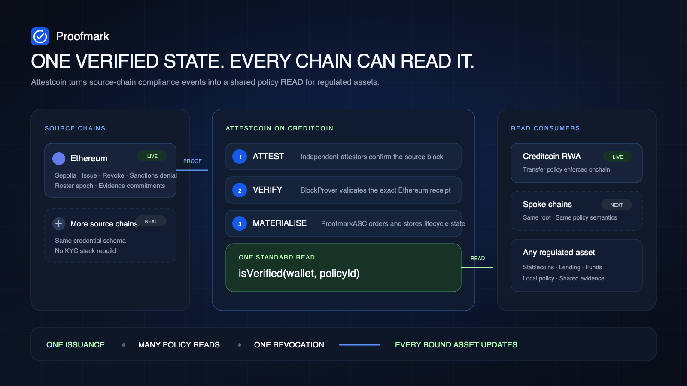

# Proofmark

> Verify once. Let every chain READ it. Let every asset enforce it.

[Live product](https://attest-kyc.stabled.ai) · [Onchain state](https://attest-kyc.stabled.ai/onchain) · [Guided verification](https://attest-kyc.stabled.ai/verify) · [Pitch deck](docs/deck/proofmark-deck.pdf)

Proofmark is the compliance READ layer for onchain finance. A KYC/AML lifecycle event is issued on one chain, verified on Creditcoin through Universal Smart Contracts (USC), and exposed as one policy-aware call:

```solidity
registry.isVerified(wallet, policyId)
```

An RWA, stablecoin or lending market can call that function on every transfer. One credential can serve many assets. Each asset keeps its own policy. One revocation updates every consumer that reads the verified state.

Built for **BUIDL CTC 2026 Fall**, RWA track.



## Why Proofmark exists

Every regulated asset must decide whether a wallet may hold or receive it at that moment. App-specific KYC forces each issuer to rebuild vendor contracts, personal-data handling, evidence retention and rescreening. A portable `KYC passed` flag loses the facts that matter: who checked the holder, which checks ran, which regime applied, how old the result is and whether the holder was later revoked.

Copying that flag across chains creates another problem. A conventional relayer signs the copied result, so the relayer key becomes the compliance authority.

Proofmark treats compliance as a read-heavy state problem. Credentials change occasionally, while assets may evaluate them on every transfer. USC proves the source-chain event. Proofmark normalises the verified facts, applies the asset's frozen policy and returns a boolean that contracts can enforce.

## Protocol design

Proofmark separates three concerns that are usually collapsed into one allowlist.

### 1. Credential facts

`ComplianceSource` emits the holder's verified facts on Ethereum:

- issuer and credential type;
- completed verification methods;
- assurance level, regime and jurisdiction;
- issuance, expiry and lifecycle epoch;
- commitments to the claims and retained evidence.

Names, birth dates, document numbers and bank-account numbers remain offchain. Wallet and issuer addresses, status metadata and commitments are public and linkable, so Proofmark describes this as pseudonymisation rather than anonymity.

### 2. Asset policy

`ProofmarkRegistry` evaluates the same credential against a policy chosen by the asset:

- required verification methods;
- minimum assurance;
- trusted issuer;
- accepted regime and jurisdiction;
- maximum credential age;
- direct credential or fresh-roster requirement.

Policies are frozen before an asset binds to them. The policy owner cannot loosen a live asset's rules after deployment. The same sandbox credential can therefore pass a pilot policy and fail a production policy without changing the underlying facts.

### 3. Asset enforcement

`GatedRwaNote` calls `isVerified` for both sender and recipient inside transfer and mint paths. Ineligible, expired, sanctioned or revoked wallets cannot move the asset. Applications can use the same interface through the copyable [consumer example](examples/consumer/README.md).

## How USC is used

[Creditcoin Universal Smart Contracts](https://docs.creditcoin.org/usc) provide the foreign-state verification layer.

1. **Issue on the source chain.** `ComplianceSource` emits `MarkIssued`, `MarkRevoked`, `SanctionDenied` and `RosterEpochPublished` events on Ethereum Sepolia.
2. **Wait for attestation.** A durable worker tracks the source receipt and Creditcoin's attested height. It obtains the Merkle inclusion and continuity proof from the USC proof-builder service.
3. **Verify on Creditcoin.** `ProofmarkASC` calls `verifyAndEmit` on the native `BlockProver` precompile. The contract uses `EvmV1Decoder` from `@gluwa/usc-contracts` to decode the verified Ethereum receipt.
4. **Materialise lifecycle state.** The ASC accepts events only from the configured USC chain key and source contract. It orders them by proven block height, transaction index and log position before updating the holder.
5. **READ and enforce.** Assets query `ProofmarkRegistry.isVerified(wallet, policyId)`. The worker only transports public proof and can be replaced without changing the Ethereum event that remains authoritative.

The deployment preflight uses `PrecompileChainInfoProvider` from `@gluwa/usc-sdk` to read supported chain metadata. It does not confuse Ethereum's chain ID `11155111` with USC's Sepolia chain key `1`.

USC fits this problem because compliance state is high-value, changes relatively slowly and may be read on every asset transfer. Proofmark does not wrap assets or move identity data between chains. It verifies the source event once and makes the resulting state reusable.

## Direct credentials and roster scale

Proofmark supports two issuance modes behind the same policy interface.

**Direct marks** materialise one credential per holder. They are easy to inspect and work well for pilots.

**Merkle roster epochs** commit an active holder set as one root. The v2 format uses domain-separated leaf and node hashes, a committed leaf count, sentinel bounds and issuer-authorised publication. Consumers that require continuous screening must cache a witness for the current epoch. A new epoch invalidates the old witness even when the root repeats.

Batch issuance and revocation place multiple holder events in one Ethereum transaction, and one USC execution applies every recognised event atomically.

## Security model

| Risk | Control |
|---|---|
| Proof from the wrong chain or a lookalike contract | The ASC permanently pins the USC chain key and `ComplianceSource` address |
| Old issuance restores a revoked holder | Lifecycle updates use proven source coordinates and reject stale ordering |
| Opposing events appear in one receipt | The ASC decodes the full receipt and applies recognised events atomically |
| Policy changes after an asset launches | The asset binds only to a frozen policy |
| Forged roster inclusion or non-inclusion | Roster v2 validates domain, position, leaf count and proof shape |
| Worker crash or replay | Signed relay envelopes persist before submission; processed query IDs cannot run twice |
| One key controls the system | Governance, issuer, rescreener, epoch publisher, worker payer and asset owner use separate roles in v2 |
| Unilateral denial correction or asset recovery | Separate proposer and approver roles plus delay and execution-time eligibility checks |

The USC integration also exposed a missing application boundary in the upstream ASC base handler: the handler did not receive enough source identity and transaction-order context. `ASCBaseX` forwards the chain key, block height and transaction index while preserving the native proof path. Regression tests cover wrong-chain acceptance, stale issuance after revocation and same-block ordering.

## Compliance and privacy

The pipeline supports wallet control through EIP-4361, pluggable identity and bank-account adapters, sanctions screening, evidence commitments, rescreening and source-chain revocation.

The hosted sandbox labels synthetic identity and bank checks as `demo:id` and `demo:bank`. Their marks carry a sandbox regime that production policy rejects. Sanctions screening uses parsed OFAC SDN, UN Consolidated and EU Financial Sanctions files; PEP and adverse-media bits remain unset until licensed sources are connected.

Sensitive inputs and vendor evidence stay in an encrypted offchain vault. The chain receives the minimum policy facts plus `claimsRoot` and `evidenceHash`. These commitments support evidence integrity but are not zero-knowledge proofs and do not make wallet activity anonymous.

## Public testnet deployment

The checked-in [deployment manifest](deployments/cc3-testnet.json) is the source of record for the v2 contract set.

| Contract | Network | Address |
|---|---|---|
| `ComplianceSource` | Ethereum Sepolia | `0xfb46D722CD70F1ed399616a9B4745E60B9220609` |
| `EvmV1Decoder` | Creditcoin CC3 | `0xfb46D722CD70F1ed399616a9B4745E60B9220609` |
| `ProofmarkASC` | Creditcoin CC3 | `0x8c29A966a30d9083B760451245aECEbBE1E2d2F4` |
| `ProofmarkRegistry` | Creditcoin CC3 | `0x5752897b1edaD4fe50908B38c4ddA5f376a43110` |
| `GatedRwaNote` | Creditcoin CC3 | `0x5C16b3A87fa909b8BDb899476D049a85A56380B5` |

The v2 contracts advertise roster format 2, policy schema 2, epoch schema 2, issuer authorisation 1 and roster-witness version 1. Their runtime hashes and contract bindings are recorded in the manifest.

The v2 path is complete on both public testnets. The [batched source issuance](https://sepolia.etherscan.io/tx/0xcad8aa328fdefb00fd0a07c30b9d34264c21ada2bf270c1fd5b5a1552940ac40) was materialised by USC in [Creditcoin transaction `0xb490…2392`](https://creditcoin-testnet.blockscout.com/tx/0xb490b654f9b829169cd6c32c46d02b556422ef99f42ebbe301a3d41fbca62392). An issuer-authorised, 24-hour roster epoch was then [published on Sepolia](https://sepolia.etherscan.io/tx/0x06a61a43f40b1ebc56cb48482f411d08d38dd97f7365cd4ae08057135da6e23c) and materialised in [Creditcoin transaction `0xf2bd…7741`](https://creditcoin-testnet.blockscout.com/tx/0xf2bda1c6faeb881885f3f6f91851a1bb72f9db41ea7b3d3b5cf2de8cb2e37741).

Both demo holders have current epoch witnesses. The note [minted 100 KPCN](https://creditcoin-testnet.blockscout.com/tx/0xdad2f501d047affcad7620b02aaec04a6e40a579d433f707edcd81e4fa1b4e11), then [transferred 40 KPCN](https://creditcoin-testnet.blockscout.com/tx/0x9a93786c134f38364ece73589d1d739e946ac93441bc08ae6d8e0ef1a0a49f29) from holder A to holder B. The same contract rejects the never-issued control address with the exact `RecipientNotVerified` error. At the recorded state, policy 1 returns `false`, policy 2 returns `true`, and the balances are 60 and 40 KPCN. The manifest records every address, runtime hash, source transaction, USC relay, roster root, witness and asset transaction.

The read-only verifier reproduces those bindings and verdicts:

```sh
npm run verify:submission
```

The hosted product currently remains a public sandbox. It must not be presented as production KYC, legal approval, an external security audit or proof of customer adoption.

## Build and test

Requirements: Node.js, npm and Foundry.

```sh
git clone --recurse-submodules https://github.com/stabled-ai/proofmark.git
cd proofmark
npm ci

npm test
npm run test:ts
npm run typecheck

cd web
npm ci
npm run lint
npm run build
```

The source-bound test-evidence command runs the complete Solidity and TypeScript suites and records the exact source fingerprint:

```sh
npm run test:evidence
```

Focused checks are also available for USC relay recovery, source reorganisation, roster publication, provider boundaries, AML matching, the evidence vault and browser flows. Integration tests use isolated local chains and explicit mocks where stated; they are not presented as public USC executions.

## Run the testnet stack

Copy `.env.example`, configure separate testnet roles and run the deployment preflight before sending a transaction.

```sh
cp .env.example .env
./script/deploy.sh preflight
./script/deploy.sh deploy

npm run worker:init-state
npm run worker

npx tsx script/demo-gate-issue.ts --dry-run
npx tsx script/demo-gate-issue.ts
npx tsx script/publish-epoch.ts --dry-run
npx tsx script/publish-epoch.ts --publish
```

`worker:init-state` is a one-time operation for a fresh dedicated worker signer. Dry runs do not authorise later writes. Production deployment also requires managed keys, persistent encrypted storage, independent review and approved provider processing policies.

## Repository map

| Path | Purpose |
|---|---|
| `src/` | USC adapter, source lifecycle, registry, roster proof and policy-gated RWA contracts |
| `test/` | Foundry security and lifecycle tests |
| `worker/` | Source scanner, USC proof transport and durable relay state |
| `pipeline/` | KYC adapters, policy facts, roster, evidence, rescreening and recovery |
| `pipeline/providers/` | External credential-provider clients, callbacks and state |
| `aml/` | Official-list ingestion, matching and evaluation |
| `zk/` | Experimental eligibility circuit and generated verifier |
| `web/` | Hosted product, APIs and onchain explorer |
| `examples/consumer/` | Minimal integration for a Creditcoin application |
| `deployments/` | Machine-readable testnet contracts and execution evidence |
| `docs/deck/` | Pitch deck source and rendered PDF |
| `docs/submission/` | DoraHacks copy and public submission assets |

## Team

Proofmark is built by Validator Inc., a Korean blockchain financial-infrastructure company working on stablecoin issuance, distribution, Proof of Reserve and AML/KYC systems.

The core team comes from GDAC and brings seven years of digital-asset exchange operating experience. As a team, we built exchange core systems, wallets, custody, non-face-to-face KYC, AML and fraud controls, evidence operations and institutional APIs. During that period, GDAC completed Korea's fourth VASP registration, exchange-and-custody ISMS certification, FinCEN MSB registration, bank due diligence and regulatory examinations, and served more than 400 corporate members.

Validator has since built token issuance and redemption contracts, reserve reconciliation, wallet and administrator products, travel-rule processing, freeze and burn controls, gasless transactions and post-quantum dual-signature integration. The registrations and certifications above belonged to GDAC's prior operator; Validator carries the team's operating experience and engineering record.

## Next milestones

The next release gates are concrete:

1. connect an external credential provider to policy-bearing issuance;
2. move keys, journals and evidence storage into managed infrastructure;
3. complete an independent security review;
4. integrate the first external asset issuer and measure issuance, revocation and rescreening service levels.

The long-term interface stays the same: every supported chain reads the same verified facts, and every asset enforces its own local policy.

## License

MIT. See [LICENSE](LICENSE).
